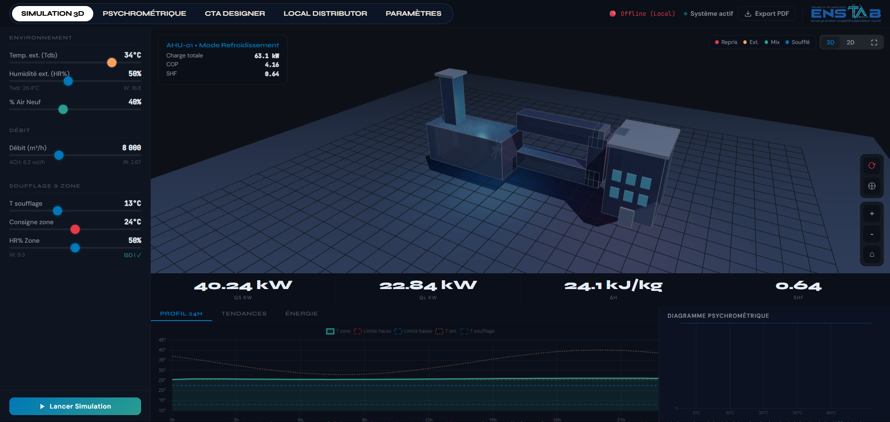

# CTA-Sim PRO & Environmental Spatial Advisor

<div align="center">
  <h3>Advanced Air Handling Unit (AHU) Simulation & Environmental GIS Platform</h3>
  <br>
  
</div>

## 📌 Overview

**CTA-Sim PRO** is a professional-grade simulation environment designed for HVAC (Heating, Ventilation, and Air Conditioning) engineers and environmental analysts. The platform merges high-fidelity thermodynamic simulations of Air Handling Units (CTA - Centrale de Traitement d'Air) with an integrated AI-powered GIS (Geographic Information System) spatial advisor.

Built to be fast, responsive, and highly interactive, the platform offers real-time visualization of psychrometric processes, energy consumption, and environmental impact assessments.

---

## 🚀 Key Features

### 1. Thermodynamic Simulation Engine
* **Interactive 2D Engineering Schematics:** Zoom, pan, and manipulate high-fidelity SVG circuit diagrams representing complex HVAC setups (Free-cooling, Heat Recovery, Multi-zone filtering).
* **Live Psychrometric Workspace:** Dynamic, real-time plotting of air states (Temperature, Humidity, Enthalpy) on a fully interactive psychrometric chart.
* **Stochastic Energy Modeling:** Real-time energy consumption graphs (kW) with stochastic noise generation and automated anomaly/overconsumption threshold detection.
* **Dynamic Tendances Dashboard:** Live efficiency (COP) vs. thermal load correlations.

### 2. Environmental Spatial Advisor Agent
* **Integrated GIS Dashboard:** Embedded directly into the "Local Distributor" interface.
* **Precision Geocoding:** High-fidelity dictionary-backed ingestion for North African academic institutions and fallback to Photon API for global spatial footprint identification.
* **Multi-Agent Pipeline:**
  * `Agent 1:` Spatial Asset Ingestion
  * `Agent 2:` Spatial Data Fetching & Rasterization
  * `Agent 3:` Vegetation & Land-Use Classification (NDVI analysis)
  * `Agent 4:` Constrained Suitability Analysis (Solar, Flood, Slope)
  * `Agent 5:` Intelligent Decision Output Generation
* **Actionable Output:** Provides exact species recommendations, carbon sequestration estimates (kg/yr), and financial payback models for land rehabilitation.

---

## 🛠️ Technology Stack

* **Frontend:** Vanilla HTML5, CSS3, JavaScript (ES6+), Chart.js, Leaflet.js
* **Backend:** Python 3.12+, FastAPI, Flask, Uvicorn
* **Geospatial Processing:** Shapely, Rtree, Agromonitoring API
* **Architecture:** Fully decoupled SPA frontend communicating asynchronously with decoupled Python micro-agents.

---

## 🚦 Getting Started

### Prerequisites
* Python 3.10 or higher
* Node (Optional, for advanced frontend tooling)

### Installation & Setup

1. **Clone the repository:**
   ```bash
   git clone https://github.com/your-username/CTA-Sim-PRO.git
   cd CTA-Sim-PRO
   ```

2. **Set up the virtual environment:**
   ```bash
   python -m venv venv
   # On Windows
   .\venv\Scripts\activate
   # On macOS/Linux
   source venv/bin/activate
   ```

3. **Install dependencies:**
   ```bash
   pip install fastapi uvicorn requests flask flask-cors shapely rtree
   ```

4. **Launch the platform:**
   Simply run the provided startup script (Windows):
   ```bash
   start.bat
   ```
   
   *This batch script will automatically:*
   * Launch the FastAPI Simulation Backend (Port 8000)
   * Launch the Environmental Advisor Agent API (Port 5050)
   * Launch the Frontend Local HTTP Server (Port 8080)
   * Open the dashboard in your default web browser.

---

## 📁 Directory Structure

```text
CTA-Sim-PRO/
├── index.html                           # Main SPA Frontend
├── start.bat                            # Master Launch Script
├── backend/                             # Core HVAC Simulation Backend
│   └── main.py
├── environemental_advisor_agent.py/     # GIS AI Agents Directory
│   ├── api.py                           # Flask Agent API (Port 5050)
│   ├── main.py                          # Local Agent Testing Entrypoint
│   ├── dashboard.html                   # Embedded GIS Dashboard UI
│   ├── agent_1_ingestion.py
│   ├── agent_2_spatial_fetch.py
│   ├── agent_3_vegetation.py
│   ├── agent_4_suitability.py
│   └── agent_5_output.py
└── venv/                                # Python Virtual Environment
```

---

## 📄 License

This project is proprietary. All rights reserved. For academic or commercial licensing inquiries, please contact the repository owner.
